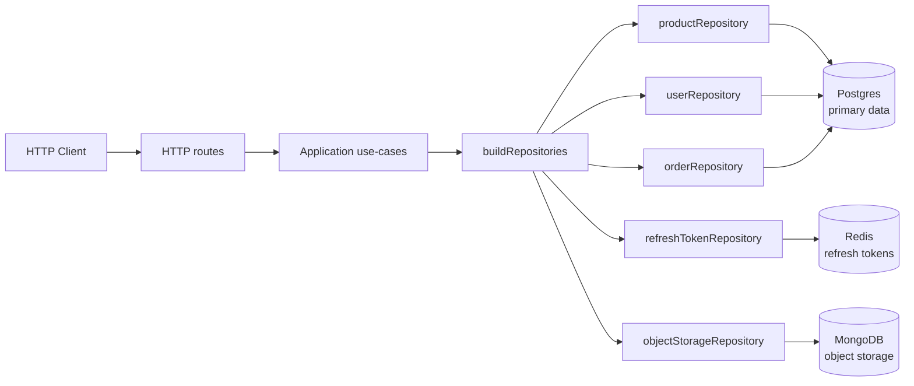
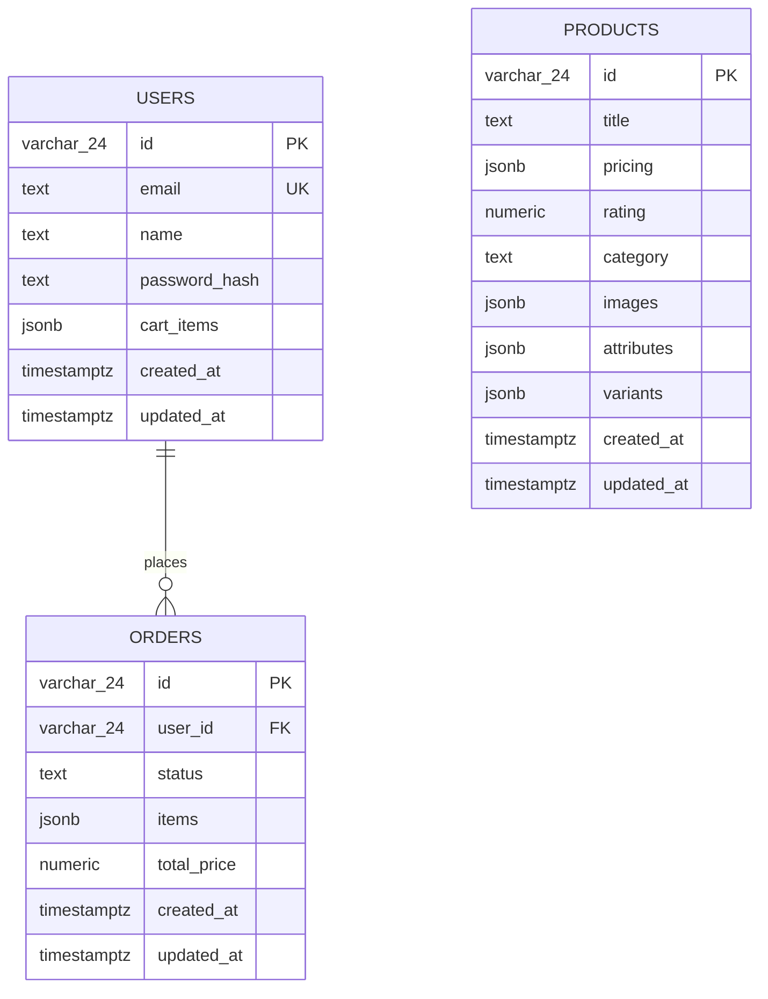
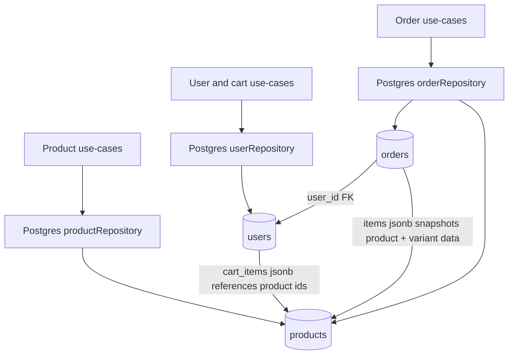
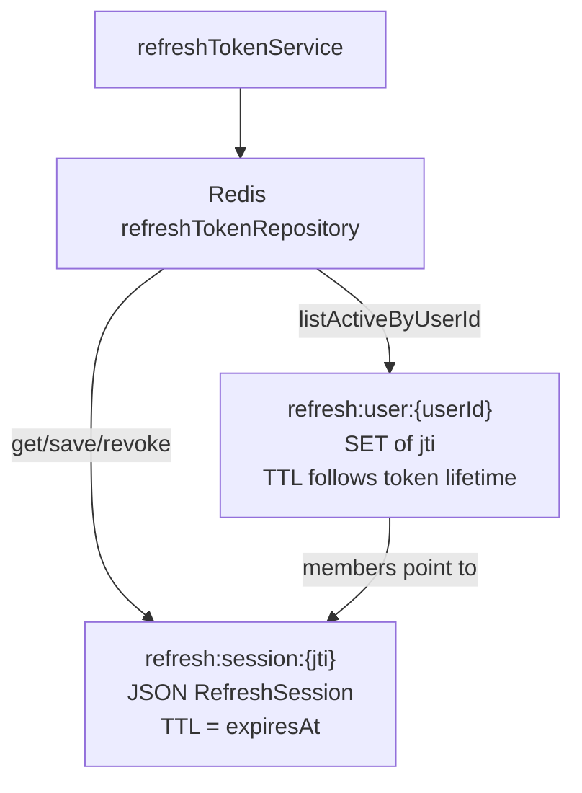
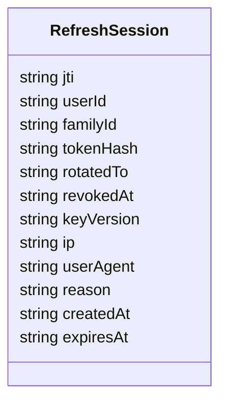
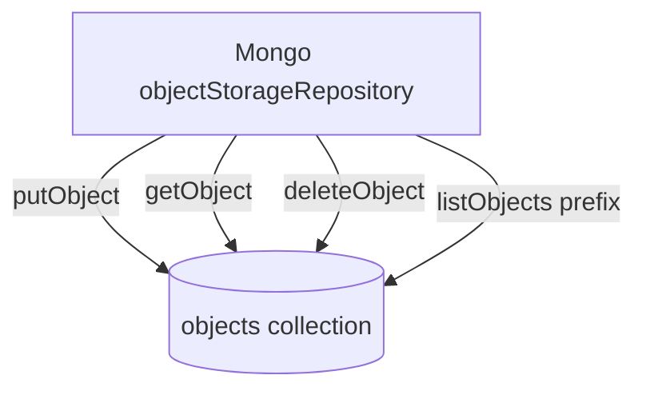
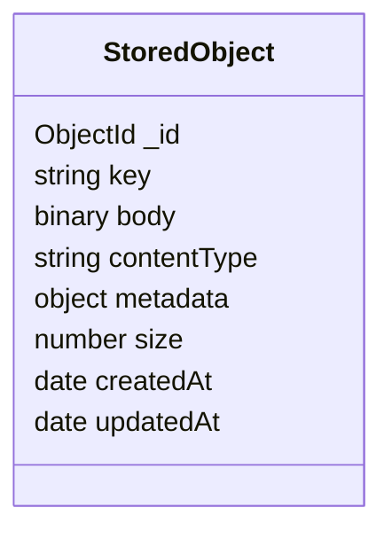
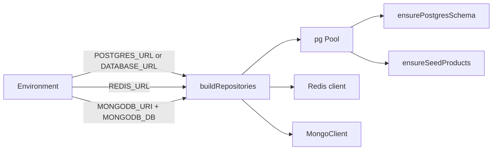

# Database Diagrams

Backend persistence is split by responsibility:

- Postgres is the primary transactional store.
- Redis stores refresh-token sessions.
- MongoDB acts as an S3-like object storage.

## Whole System

## Postgres

Postgres owns durable business data: products, users, carts, and orders.

## Redis

Redis stores refresh-token sessions by `jti` and keeps a per-user set of active token ids.

## MongoDB

MongoDB is no longer the primary business database. It is used as an object storage adapter.

## Runtime Connections

